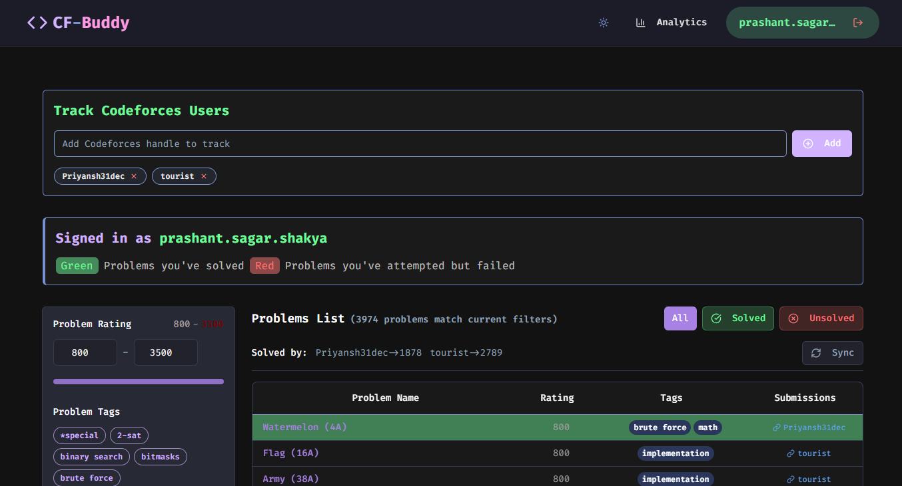

# CF-Buddy 🚀 :: Analyze & Compare Codeforces Progress

**CF-Buddy** is a modern web application designed for competitive programmers to track, analyze, and compare problem-solving progress on Codeforces. Add multiple user handles, filter problems by rating and tags, view consolidated lists, visualize analytics, and gain insights into your and your friends' Codeforces journeys!

 

---

## ✨ Key Features

-   **👤 Multi-User Tracking**: Add multiple Codeforces handles to monitor solved problems side-by-side.
-   **🎯 Current User Context**: Designate a "current user" (by signing in with a handle) to:
    -   See problems *you've solved* highlighted green in the list.
    -   See problems *you've attempted unsuccessfully* highlighted red.
    -   Filter the list to show only problems you *have* or *have not* solved.
-   **📊 User Analytics Dashboard**: (Accessible via Header Button on Desktop)
    -   **Rating History**: Visualize rating changes over time with rank color bands.
    -   **Activity Heatmap**: See submission consistency with a GitHub-style heatmap.
    -   **Detailed Statistics**: Track total problems solved, yearly/monthly counts, and longest solving streaks.
    -   **Problem Difficulty Analysis**: Bar chart showing the distribution of solved problems by rating.
    *   **Tag Analysis**: Pie/Donut chart displaying the distribution of solved problem tags.
-   **🔍 Advanced Problem Filtering**:
    -   **Rating Slider**: Dynamically filter problems by minimum and maximum rating.
    -   **Tag Selection**: Filter by multiple Codeforces tags (e.g., "dp", "graphs", "data structures"). Tags are automatically populated based on the added users' solved problems.
-   **📋 Consolidated Problem List**:
    -   View problems solved by *any* of the tracked users (matching filters), excluding duplicates.
    -   Clearly see *who* solved each problem (excluding the current signed-in user from this list).
    -   Link to others' submissions (where available).
    -   Sort problems easily by rating.
-   **🌐 Language Localization**: Problem names and some contest details are displayed based on your browser's preferred language setting (supports English and Russian via Codeforces API).
-   **🎨 Dark/Light Mode**: Toggle between themes for comfortable viewing.
-   **📱 Responsive Design**: Adapts gracefully to different screen sizes (desktop, tablet, mobile).
-   **💬 Toast Notifications**: User-friendly feedback for actions like adding users, sign-in, and API errors.
-   **⏳ Loading States**: Clear visual indicators while data is being fetched.

---

## 🛠️ Tech Stack

-   **Core**:
    -   [React](https://reactjs.org/) (v18+) - UI Library
    -   [TypeScript](https://www.typescriptlang.org/) - Static Typing
    -   [Vite](https://vitejs.dev/) - Build Tool & Dev Server
    -   [React Router DOM](https://reactrouter.com/) - Client-side Routing
-   **UI & Styling**:
    -   [Tailwind CSS](https://tailwindcss.com/) - Utility-First CSS Framework
    -   [Shadcn/UI](https://ui.shadcn.com/) - Accessible & Reusable Component Primitives
    -   [Lucide React](https://lucide.dev/) - Icon Library
-   **Charting & Visualization**:
    -   [Recharts](https://recharts.org/) - Composable Charting Library
    -   [date-fns](https://date-fns.org/) - Modern Date Utility Library
    -   (Optional: `react-calendar-heatmap`, `react-tooltip`)
-   **State Management**:
    -   React Context API (`UserContext`, `ThemeContext`)
-   **Data Fetching & API**:
    -   Browser `fetch` API
    -   [Codeforces API](https://codeforces.com/apiHelp)
-   **(Development)**
    -   ESLint / Prettier (Assumed for code quality)

---

## 📋 Prerequisites

-   [Node.js](https://nodejs.org/) - LTS version (v18.x or v20.x recommended)
-   [npm](https://www.npmjs.com/) (v9+) or [yarn](https://classic.yarnpkg.com/) (v1.22+)

---

## 🚀 Getting Started

Get your local copy up and running in a few steps:

1.  **Clone the repository:**
    ```bash
    git clone https://github.com/prashant-sagar-shakya/CF-Buddy.git
    cd CF-Buddy
    ```

2.  **Install dependencies:**
    *   Using npm:
        ```bash
        npm install
        ```
    *   Or using yarn:
        ```bash
        yarn install
        ```

3.  **Run the development server:**
    *   Using npm:
        ```bash
        npm run dev
        ```
    *   Or using yarn:
        ```bash
        yarn dev
        ```

4.  **Open your browser:** Navigate to `http://localhost:5173` (or the port specified in your console output).

---

## 🎈 Usage Guide

1.  **Launch:** Start the application using the steps above.
2.  **Add Handles:** Use the input field (likely near the top) to add one or more Codeforces handles you want to track.
3.  **Sign In (Set Current User):** Click the "Sign In" button in the header and enter *your* Codeforces handle. This handle will be used as the reference point for highlighting solved/attempted problems.
4.  **Filter Problems:**
    *   Use the **Rating Slider** to select a difficulty range.
    *   Click on **Tags** in the filter section to narrow down problems by topic. Available tags update based on the problems fetched for the added handles.
5.  **View Problem List:** The main area will display a consolidated list of problems solved by the added handles (matching your filters), sorted by rating.
    *   Observe the green/red highlights indicating your (current user's) status on those problems.
    *   See which *other* users solved each problem and link to their submissions.
6.  **Explore Analytics:**
    *   Click the **Analytics** button (📊 icon, visible on desktop in the header).
    *   Analyze rating trends, submission activity, rating/tag distributions for the signed-in user (or navigate to `/analytics/<handle>` manually if needed).
7.  **Toggle Theme:** Use the Sun/Moon icon in the header to switch between light and dark modes.

---

## 🧪 Running Tests

*(This section is a placeholder. Update if you add tests.)*

```bash
# Example using Vitest (if configured)
npm run test
# or
yarn test
```

Provide details on the testing framework used (e.g., Vitest, Jest, React Testing Library) and any specific setup required.

---

## 🤝 Contributing

Contributions make the open-source community great! Any contributions are **welcome and greatly appreciated**.

If you have improvements or features in mind:

1.  **Check for existing issues:** Look for related discussions or tasks.
2.  **Fork the Project:** Create your own copy.
3.  **Create a Feature Branch:** (`git checkout -b feature/YourAmazingFeature`)
4.  **Make your changes:** Implement your feature or bug fix.
5.  **Commit your Changes:** (`git commit -m 'feat: Add some AmazingFeature'`) - Follow Conventional Commits if possible.
6.  **Ensure Code Quality:** Run linters/formatters if set up (`npm run lint` / `yarn lint`).
7.  **Push to the Branch:** (`git push origin feature/YourAmazingFeature`)
8.  **Open a Pull Request:** Describe your changes clearly.

You can also open an issue with the tag "enhancement" or "bug" if you find problems or have ideas. Thank you! ⭐

---

## 📜 License

Distributed under the MIT License. See `LICENSE.md` for more information.

---

## 🙏 Acknowledgements

*   **Codeforces:** For their fantastic platform and public API.
*   **Shadcn/UI:** For the elegant component library structure.
*   **Recharts:** For the charting capabilities.
*   **Lucide React:** For the clean icons.
*   **Vite Team:** For the blazing fast development experience.
*   **Tailwind Labs:** For the utility-first CSS framework.